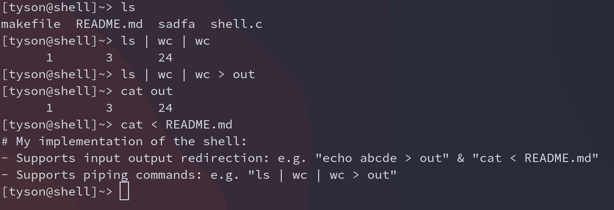
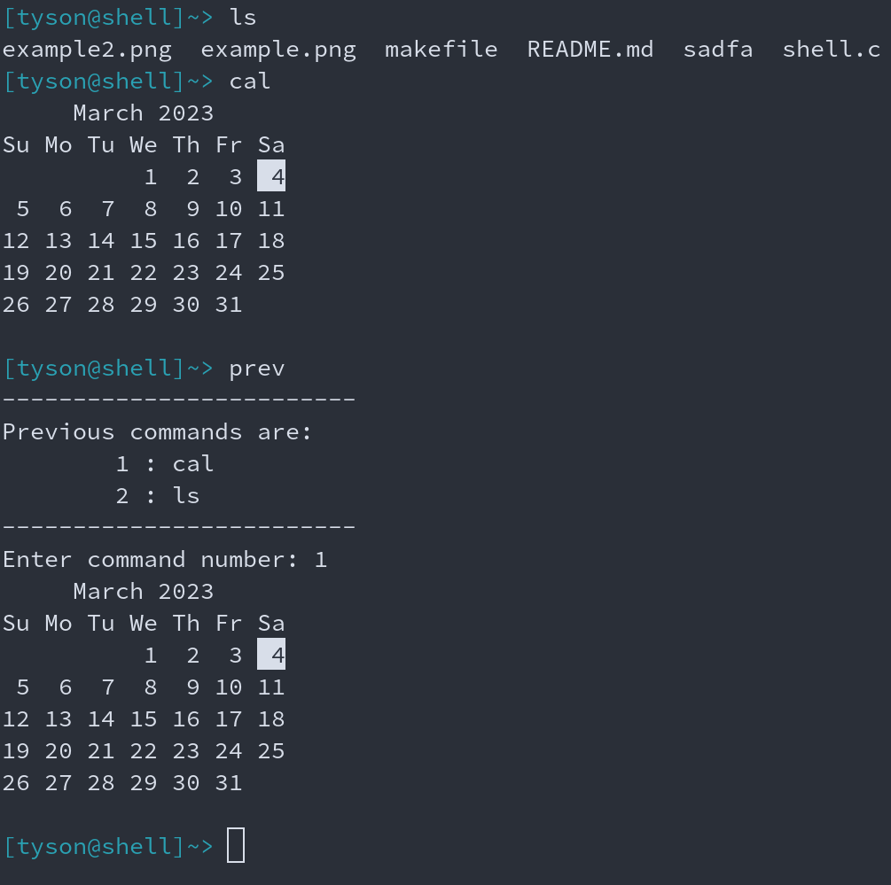

# My implementation of the shell:
- Supports input output redirection: e.g. "echo abcde > out" & "cat < README.md" 
- Supports piping commands: e.g. "ls | wc | wc > out"
- Supports "prev" command that allows the user to look up 10 most recent command-line inputs and prompts the user to enter the index of the cmd-line input to execute it.

Usage:
To build the binary:

```
make
```

Example:
- Piping and I/O redirection:


- "prev" command:

